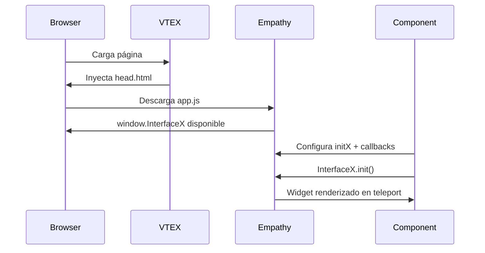
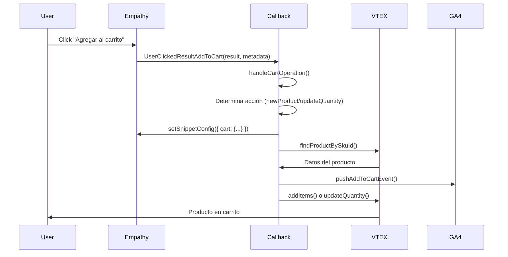
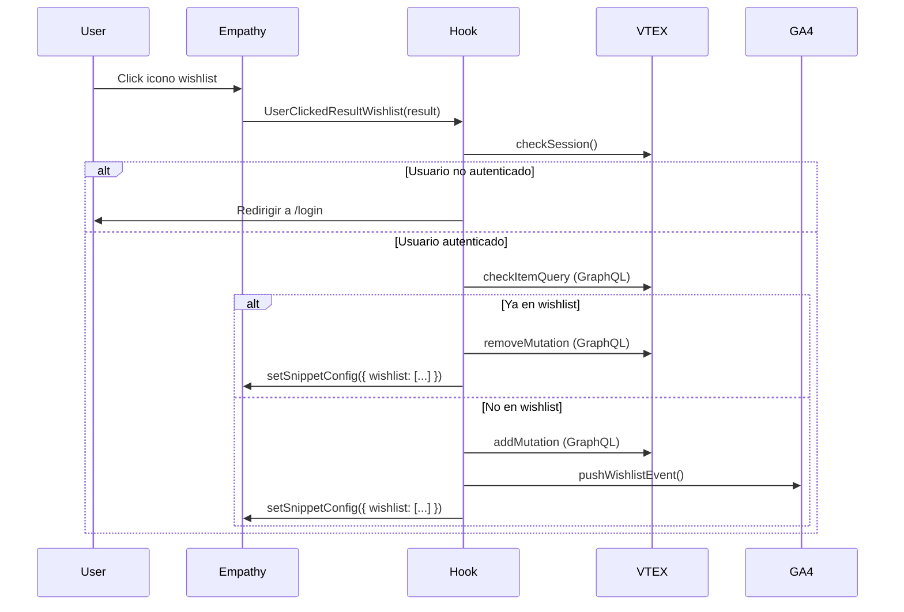

# Empathy Pixel App for VTEX

**Template de integración** desarrollado para implementar la experiencia de busqueda **Empathy** en tiendas VTEX. Esta aplicación inyecta un widget de búsqueda avanzada mediante VTEX Pixel, siguiendo las prácticas recomendadas por VTEX.

---

## Tabla de Contenidos

- [Descripción General](#descripción-general)
- [Requisitos Previos](#requisitos-previos)
- [Instalación](#instalación)
- [Configuración](#configuración)
- [Arquitectura](#arquitectura)
- [Componentes Principales](#componentes-principales)
- [Flujo de Integración](#flujo-de-integración)
- [Conceptos Clave](#conceptos-clave)
- [Configuración por Cliente](#configuración-por-cliente)
- [Debugging](#debugging)
- [Contributors](#contributors)

---

## Descripción General

Esta app es una **solución template configurable** que permite integrar el buscador de Empathy en tiendas VTEX. Cada cliente puede tener diferentes configuraciones según sus necesidades:

✅ **Con o sin variantes** de productos  
✅ **Con o sin botón de add to cart**  
✅ **Con o sin quantity selector**  
✅ **Con o sin wishlist**  

### Funcionalidades Principales

- 🔍 **Búsqueda avanzada** mediante el widget de Empathy
- 🛒 **Integración con carrito VTEX** (add/remove/update)
- ❤️ **Gestión de wishlist** con sincronización visual
- 📊 **Eventos de analítica GA4** personalizados
- 🔄 **Comunicación bidireccional** mediante el `setSnippetConfig`

---

## Requisitos Previos

> **⚠️ IMPORTANTE:** Antes de instalar esta app, asegúrate de que:

1. El **conector backend** de Empathy esté correctamente configurado
2. El **catálogo de VTEX** se esté enviando como feed a Empathy
3. El equipo de **Empathy haya mapeado el feed** correctamente
4. Tengas acceso al **script de Empathy** de cada cliente (`app.js`) provisto por el equipo de Empathy

---

## Instalación

Esta aplicación está diseñada para operar como una **App Privada**. Sigue estos pasos para configurarla e instalarla bajo la cuenta correspondiente.

### Prerrequisitos
Asegúrate de estar logueado en la cuenta objetivo:
```bash
   vtex login <account-name>
```

### Pasos

1. Clona o realiza un Fork de este repositorio:
   ```bash
   git clone https://github.com/empathyco/empathy-pixel-app-archetype
   cd empathy-pixel-app-archetype
   ```

2. Configura tu aplicación siguiendo la guía de configuración detallada en la sección [Configuración](#configuración).

3. Instala la aplicación: Instala la versión recién publicada en el workspace actual:
   ```bash
   vtex install
   ```

4. Verifica la instalación:
   ```bash
   vtex ls | grep <account-name>.empathy-pixel-app
   ```

---

## Configuración

### 1. manifest.json - Vendor y Versionado

Configura el Vendor (Account Name): Abre el archivo manifest.json en la raíz del proyecto. Cambia el valor del campo vendor por el nombre de la cuenta (account name) donde se instalará la aplicación.

```json
// manifest.json
{
"name": "empathy-pixel-app",
"vendor": "TU_ACCOUNT_NAME",
"version": "0.0.x",
}
```

Nota: Esto cambiará el ID de la app a TU_ACCOUNT_NAME.empathy-pixel-app.

### 2. Script de Empathy

Actualiza el archivo `pixel/head.html` con la URL del script de Empathy proporcionada por el equipo:

```html
<script src="https://x.empathy.co/x-{INSTANCE}/app.js" type="module"></script>
```

Ejemplo:
```html
<script src="https://x.empathy.co/x-chedraui/app.js" type="module"></script>
```

### 3. Configuración InitX

En `react/Components/EmpathySearchbar/index.tsx`, configura los parámetros del cliente:

Ejemplo:
```tsx
(window as any).initX = {
    instance: "{INSTANCE}",        // Identificador del cliente provisto por Empathy. Ej: 'chedraui'
    lang: "es",                    // Idioma: 'es', 'en', 'pt', etc.
    scope: "desktop",              // 'desktop' o 'mobile'
    currency: "EUR",               // 'EUR', 'USD', 'MXN', etc.
    consent: false,
    viewMode: 'embedded',
    callbacks: { ... }
};
```

### 4. Agregar Componentes a la Store

En tu theme, agrega los siguientes bloques para renderizar el cajón de búsqueda y los resultados. Añadelo en todas las templates donde quieras que aparezca el buscador (home, categoría, producto, etc.):

```json
{
  "store.home": {
    "blocks": [
      "empathy-searchbar",
      "empathy-results"
    ]
  }
}
```

> 📚 **Más información:** Puedes obtener más detalles sobre cómo se integra Empathy en la [documentación oficial de Empathy](https://docs.empathy.co/develop-empathy-platform/build-search-ui/web-archetype-integration-guide.html).

---

## Arquitectura

### Estructura del Proyecto

```
empathy-pixel-app-archetype/
├── manifest.json             # Configuración de la app VTEX
├── pixel/
│   └── head.html             # Script de inicialización de Empathy
├── store/
│   ├── interfaces.json       # Definición de componentes React
│   └── plugins.json          # Configuración de pixel manager
├── react/
│   ├── index.tsx             # Entry point del pixel
│   ├── Components/
│   │   ├── EmpathySearchbar/ # 🔑 Componente principal
│   │   │   ├── index.tsx
│   │   │   ├── constants.tsx
│   │   │   ├── utils/
│   │   │   │   ├── index.tsx       # Utilidades generales
│   │   │   │   └── handleCart.ts   # Lógica de carrito
│   │   │   ├── hooks/
│   │   │   │   ├── handleWishlist.ts
│   │   │   │   └── useGAAnalytics.ts
│   │   │   └── gql/               # GraphQL queries
│   │   └── EmpathyResults/    # Overlay de resultados
└── docs/
    └── README.md
```

### Dependencias VTEX

```json
{
  "vtex.pixel-interfaces": "1.x",
  "vtex.order-items": "0.x",
  "vtex.order-manager": "0.x",
  "vtex.styleguide": "9.x",
  "vtex.pixel-manager": "1.x",
  "vtex.session-client": "1.x",
  "vtex.wish-list": "1.x"  // Opcional (solo si se usa wishlist)
}
```

---

## Componentes Principales

### EmpathySearchbar

El componente principal que:
- Inicializa el widget de Empathy mediante `initX`
- Configura callbacks para interacciones del usuario
- Gestiona la comunicación con VTEX (carrito, wishlist)
- Envía eventos de analítica a GA4

**Callbacks disponibles:**

| Callback | Descripción |
|----------|-------------|
| `UserClickedResultAddToCart` | Click en "agregar al carrito" (producto simple) |
| `UserClickedResultVariantAddToCart` | Click en "agregar al carrito" (con variantes) |
| `UserClickedResultRemoveFromCart` | Click en "quitar del carrito" (producto simple) |
| `UserClickedResultVariantRemoveFromCart` | Click en "quitar del carrito" (con variantes) |
| `UserClickedResultWishlist` | Click en el icono de wishlist |

### EmpathyResults

Contenedor overlay para mostrar los resultados de búsqueda. Empathy "teleporta" su UI a este componente usando `data-teleport`.

### Utils y Hooks

- **`handleCart.ts`**: Lógica centralizada para operaciones de carrito
- **`handleWishlist.ts`**: Gestión completa de wishlist con GraphQL
- **`useGAAnalytics.ts`**: Envío de eventos personalizados a GA4
- **`index.tsx` (utils)**: Funciones auxiliares (`findProductBySkuId`, `mapProductForGA4`)

---

## Flujo de Integración

### 1. Inicialización (Carga de Página)



### 2. Flujo Add to Cart



### 3. Flujo Wishlist



---

## Conceptos Clave

### `setSnippetConfig` - API de Comunicación

Esta es la **interfaz principal** para comunicarse con el widget de Empathy:

```tsx
(window as any).InterfaceX.setSnippetConfig({
    cart: { 
        "123": 2,      // SKU ID → Cantidad
        "456": 1 
    },          
    wishlist: ["789", "101112"],   // Array de SKU IDs en wishlist
    // ... otros parámetros
});
```

**¿Qué hace?**
- ✅ Actualiza el estado visual del widget
- ✅ Muestra cantidades en el carrito
- ✅ Marca productos con icono de wishlist "filled"


> 📚 **Más información:** Puedes obtener más información sobre la configuración del snippet en la [documentación oficial de Empathy](https://docs.empathy.co/develop-empathy-platform/build-search-ui/web-archetype-integration-guide.html#snippet-configuration).

### Eventos GA4

La app envía 3 eventos personalizados:

- **`add_to_cart_empathy`**: Cuando se agrega un producto
- **`remove_from_cart_empathy`**: Cuando se quita un producto
- **`add_to_wishlist_empathy`**: Cuando se agrega a favoritos

Todos incluyen:
- `search_term`: El término de búsqueda que generó la interacción
- `ecommerce.items[]`: Datos del producto en formato GA4

---

## Configuración por Cliente

### Checklist de Implementación

#### Script de Empathy
- [ ] Cambiar URL en `pixel/head.html` según entorno del cliente
- [ ] Verificar que el script se cargue correctamente (`console.log(window.InterfaceX)`)

#### InitX Configuration
- [ ] Actualizar `instance` (identificador del cliente en Empathy)
- [ ] Ajustar `lang` según idioma del sitio
- [ ] Configurar `currency` según moneda de la tienda
- [ ] Verificar `scope`: `'desktop'` o `'mobile'`

#### Funcionalidades Opcionales
- [ ] ¿El cliente tiene **variantes**? → Mantener callbacks de `Variant`
- [ ] ¿El cliente tiene **add to cart**? → Configurar callbacks de `AddToCart`
- [ ] ¿El cliente tiene **quantity selector**? → Verificar `metadata.inputValue`
- [ ] ¿El cliente tiene **wishlist**? → Verificar dependencia `vtex.wish-list`

#### Backend y Testing
- [ ] Verificar que el conector backend esté instalado
- [ ] Confirmar que el feed se envíe correctamente a Empathy
- [ ] Validar que Empathy haya mapeado el feed
- [ ] Probar búsqueda y resultados
- [ ] Probar add/remove from cart (con y sin variantes)
- [ ] Probar wishlist (agregar/remover)
- [ ] Verificar eventos GA4 en `window.dataLayer`

---

## Debugging

### Verificaciones Básicas

```javascript
// 1. Verificar que Empathy está cargado
console.log(window.InterfaceX);

// 2. Ver configuración actual
console.log(window.InterfaceX.getSnippetConfig());

// 3. Ver cart sincronizado
console.log(window.InterfaceX.getSnippetConfig()?.cart);

// 4. Ver wishlist sincronizada
console.log(window.InterfaceX.getSnippetConfig()?.wishlist);

// 5. Ver eventos GA4
console.log(window.dataLayer);
```

### Problemas Comunes

| Problema | Solución |
|----------|----------|
| Widget no se muestra | Verificar que el script en `head.html` se cargue correctamente |
| `InterfaceX is undefined` | El script de Empathy no se cargó. Revisar URL y conectividad |
| Cart no sincroniza | Revisar que `setSnippetConfig` se llame después de `init()` |
| Wishlist no funciona | Verificar que `vtex.wish-list` esté instalada |
| Eventos GA4 no aparecen | Revisar que `window.dataLayer` exista antes de push |

---

## Contributors

Desarrollado por el equipo de **Experimentality** para implementaciones de Empathy en VTEX.

---
